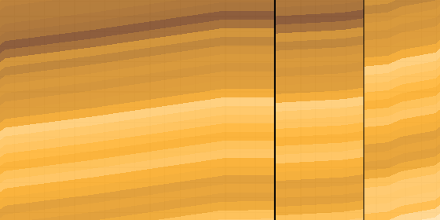

# Geology-Forecast-Challenge




## Overview
The **Geology Forecast Challenge** is a data-driven competition focused on predicting **1D layer-depth sequences** for geological formations where lateral wells are typical.

## Features
- Sequence-to-sequence models (Encoder-Decoder LSTMs)
- Data preprocessing for geological profile prediction
- Model training and evaluation scripts

## Installation
To get started, clone the repository and install dependencies:
```bash
git clone <your-repository-url>
cd Geology-Forecast-Challenge
pip install -r requirements.txt


Usage
Run the main script to train the model:
python train_model.py --data_path ./data/geology_data.csv


Contributors
Ishita

License
This project is licensed under [License Name]. See LICENSE for more details.

